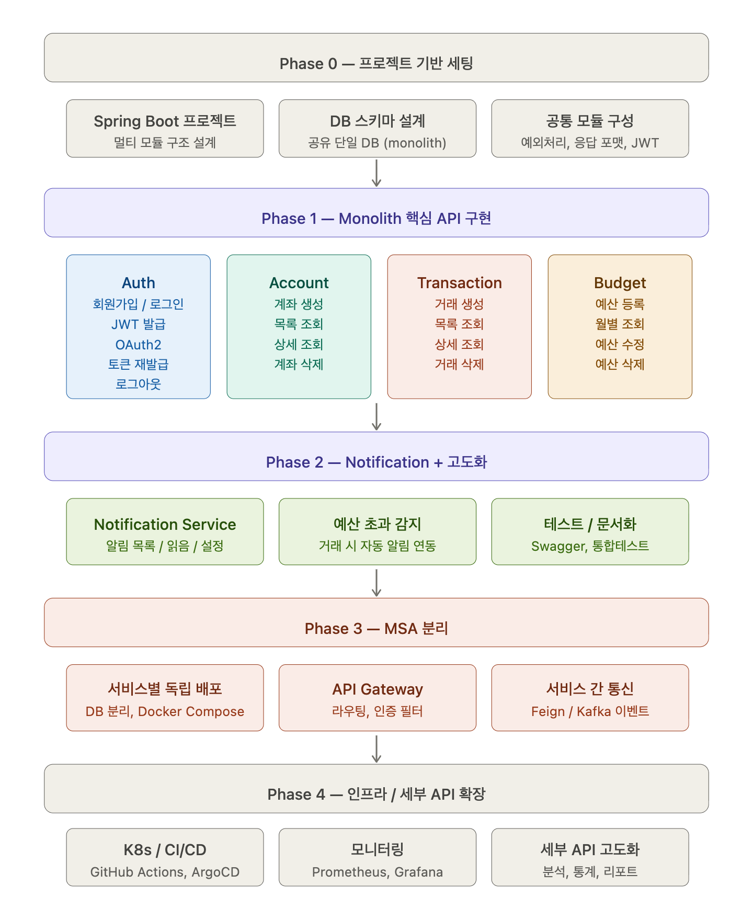
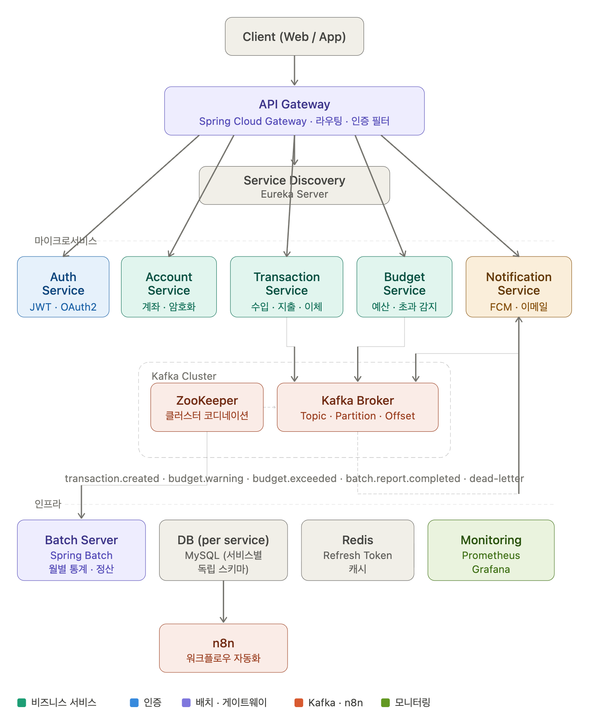
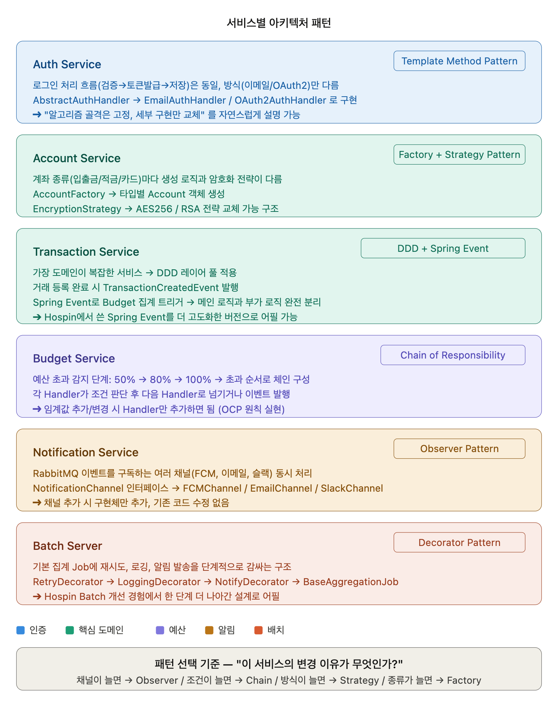

# FintTacking

---

자산 관리 플렛폼

---

## 레포지터리 구성

| 구분       | 서비스                   | 역할                                               | 원격 레포지터리                                                                         |
| ---------- | ------------------------ | -------------------------------------------------- | --------------------------------------------------------------------------------------- |
| **인프라** | fintracking-discovery    | Eureka 서버                                        | [jae9380/fintracking-discovery](https://github.com/jae9380/fintracking-discovery)       |
| **인프라** | fintracking-config       | Spring Cloud Config 서버                           | [jae9380/fintracking-config](https://github.com/jae9380/fintracking-config)             |
| **인프라** | fintracking-config-repo  | Config 설정 파일 저장소                            | [jae9380/fintracking-config-repo](https://github.com/jae9380/fintracking-config-repo)   |
| **인프라** | fintracking-gateway      | API Gateway (JWT 검증, 라우팅)                     | [jae9380/fintracking-gateway](https://github.com/jae9380/fintracking-gateway)           |
| **공통**   | fintracking-common       | 공유 라이브러리 (예외, 응답, Kafka 추상화, 메트릭) | [jae9380/fintracking-common](https://github.com/jae9380/fintracking-common)             |
| **서비스** | fintracking-auth         | 회원가입/로그인, JWT 발급, OAuth2                  | [jae9380/fintracking-auth](https://github.com/jae9380/fintracking-auth)                 |
| **서비스** | fintracking-account      | 계좌 관리, AES-256 암호화                          | [jae9380/fintracking-account](https://github.com/jae9380/fintracking-account)           |
| **서비스** | fintracking-transaction  | 거래 내역 CRUD, Kafka 이벤트 발행                  | [jae9380/fintracking-transaction](https://github.com/jae9380/fintracking-transaction)   |
| **서비스** | fintracking-budget       | 예산 설정, Chain of Responsibility 알림            | [jae9380/fintracking-budget](https://github.com/jae9380/fintracking-budget)             |
| **서비스** | fintracking-notification | FCM/이메일 알림 발송                               | [jae9380/fintracking-notification](https://github.com/jae9380/fintracking-notification) |
| **서비스** | fintracking-batch        | Spring Batch 월간 통계 집계                        | [jae9380/fintracking-batch](https://github.com/jae9380/fintracking-batch)               |

---

## Pipe Line

## 전체 구조

---

## 아키텍처

---

## MVP

---
