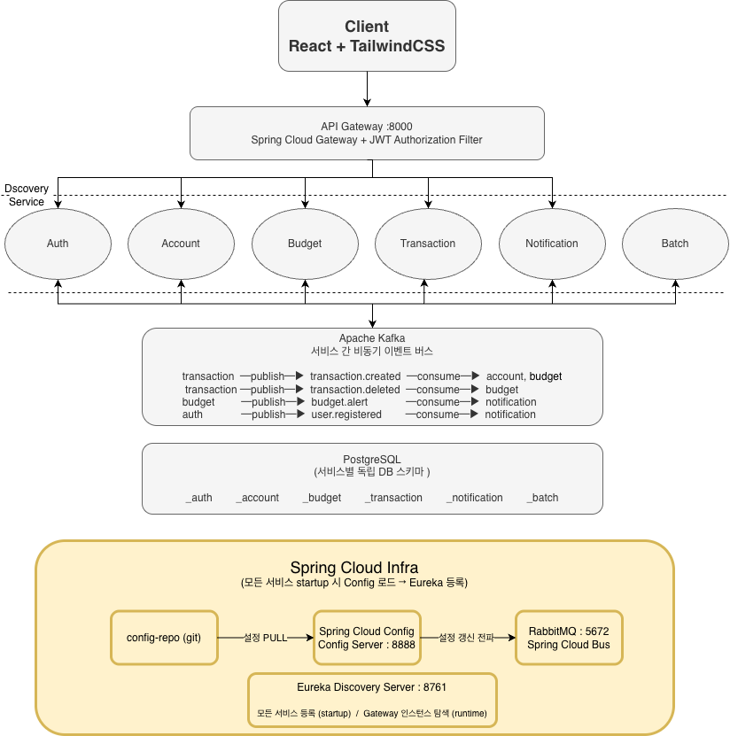
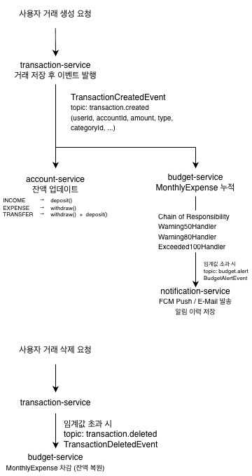

# FinTracking

개인 자산 관리 플랫폼 — Spring Boot 3.5 기반 MSA 포트폴리오 프로젝트

---

## 프로젝트 소개

계좌 관리, 거래 내역 기록, 예산 설정, 알림 발송 기능을 제공하는 개인 자산 관리 플랫폼

모놀리식 설계에서 출발하여 **MSA(Microservice Architecture)로 전환**하는 과정을 직접 설계하고 구현한 프로젝트입니다.
서비스 간 결합도를 낮추기 위해 **Kafka 이벤트 기반 비동기 통신**을 채택하였으며, 각 서비스에 적합한 **디자인 패턴**을 의도적으로 적용하였습니다.

---

## 기술 스택 상세

### Backend

|    분류     |             기술             |       분류        |          기술           |
| :---------: | :--------------------------: | :---------------: | :---------------------: |
|  Language   |           Java 21            |     Framework     |     Spring Boot 3.5     |
| API Gateway |     Spring Cloud Gateway     | Service Discovery |   Spring Cloud Eureka   |
| Config 관리 |  Spring Cloud Config Server  | Config 갱신 전파  |    Spring Cloud Bus     |
|     ORM     | Spring Data JPA (Hibernate)  |       Batch       |      Spring Batch       |
|    보안     |     Spring Security, JWT     |      메시징       |      Apache Kafka       |
|  푸시 알림  |   Firebase Admin SDK (FCM)   |      이메일       |  JavaMailSender (SMTP)  |
| 소셜 로그인 |         Kakao OAuth2         |      암호화       |       AES-256 CBC       |
|  API 문서   |          Swagger UI          |      메트릭       | Micrometer + Prometheus |
|  분산 추적  | Spring Cloud Sleuth + Zipkin |       빌드        |         Gradle          |

### Frontend

|   분류    |         기술          |
| :-------: | :-------------------: |
| Language  |      TypeScript       |
| Framework |       React 18        |
| 빌드 도구 |         Vite          |
|  스타일   |     Tailwind CSS      |
| 푸시 알림 | Firebase JS SDK (FCM) |

### Infrastructure / DevOps

|     분류      |           기술           |
| :-----------: | :----------------------: |
|   컨테이너    |  Docker, Docker Compose  |
| 데이터베이스  |      PostgreSQL 16       |
|  이벤트 버스  | Apache Kafka + Zookeeper |
| 메시지 브로커 |         RabbitMQ         |
|  메트릭 수집  |        Prometheus        |
| 메트릭 시각화 |         Grafana          |
|   분산 추적   |          Zipkin          |

---

## 전체 아키텍처



---

## 서비스 구성

|  구분  |          서비스          |  포트  |                        역할                        |                           레포지토리                            |
| :----: | :----------------------: | :----: | :------------------------------------------------: | :-------------------------------------------------------------: |
| 인프라 |  fintracking-discovery   |  8761  |                    Eureka 서버                     |  [바로가기](https://github.com/jae9380/fintracking-discovery)   |
| 인프라 |    fintracking-config    |  8888  |              Spring Cloud Config 서버              |    [바로가기](https://github.com/jae9380/fintracking-config)    |
| 인프라 | fintracking-config-repo  |  N/A   |              Config 설정 파일 저장소               | [바로가기](https://github.com/jae9380/fintracking-config-repo)  |
| 인프라 |   fintracking-gateway    |  8000  |           API Gateway (JWT 검증, 라우팅)           |   [바로가기](https://github.com/jae9380/fintracking-gateway)    |
|  공통  |    fintracking-common    |  N/A   | 공유 라이브러리 (예외, 응답, Kafka 추상화, 메트릭) |    [바로가기](https://github.com/jae9380/fintracking-common)    |
| 서비스 |     fintracking-auth     | random |      회원가입/로그인, JWT 발급, Kakao OAuth2       |     [바로가기](https://github.com/jae9380/fintracking-auth)     |
| 서비스 |   fintracking-account    | random |         계좌 관리, AES-256 계좌번호 암호화         |   [바로가기](https://github.com/jae9380/fintracking-account)    |
| 서비스 | fintracking-transaction  | random |         거래 내역 CRUD, Kafka 이벤트 발행          | [바로가기](https://github.com/jae9380/fintracking-transaction)  |
| 서비스 |    fintracking-budget    | random |    예산 설정, Chain of Responsibility 알림 체인    |    [바로가기](https://github.com/jae9380/fintracking-budget)    |
| 서비스 | fintracking-notification | random |               FCM / 이메일 알림 발송               | [바로가기](https://github.com/jae9380/fintracking-notification) |
| 서비스 |    fintracking-batch     | random |            Spring Batch 월간 통계 집계             |    [바로가기](https://github.com/jae9380/fintracking-batch)     |

---

## Kafka 이벤트 흐름



---

## 핵심 설계 포인트

### MSA 통신 원칙

- 서비스 간 **직접 DB 접근 금지** — 각 서비스가 자신의 DB만 소유
- 서비스 간 **동기 호출 금지** — RestTemplate / Feign 미사용
- 서비스 간 통신은 **Kafka 이벤트만** 허용

### 적용 디자인 패턴

|          서비스          |          패턴           |                         의도                         |
| :----------------------: | :---------------------: | :--------------------------------------------------: |
|     fintracking-auth     |     Template Method     | 이메일/OAuth2 등 인증 방식 확장 시 공통 흐름 재사용  |
|   fintracking-account    |   Factory + Strategy    |    계좌 타입별 생성, 암호화 알고리즘 런타임 교체     |
| fintracking-transaction  |   DDD + Event Driven    |     도메인 중심 설계, 부가 로직을 이벤트로 위임      |
|    fintracking-budget    | Chain of Responsibility |      예산 임계값(50/80/100%) 독립 핸들러로 분리      |
| fintracking-notification |   Strategy + Observer   | 알림 채널(FCM/이메일) 독립 전략, Kafka로 이벤트 수신 |
|    fintracking-batch     |        Decorator        |       로깅/재시도/알림 기능을 독립적으로 조합        |

### 공통 라이브러리 (fintracking-common)

모든 서비스가 공유하는 컴포넌트를 단일 라이브러리로 관리합니다.

```
fintracking-common
  ├── CustomException + ErrorCode     — 예외 처리 표준
  ├── ApiResponse<T>                  — 응답 표준 (statusCode, message, data)
  ├── BaseEntity                      — createdAt, updatedAt 감사 필드
  ├── AbstractEventPublisher<T>       — Kafka Producer 추상 클래스
  ├── EventHandler<T>                 — Kafka Consumer 인터페이스
  ├── KafkaTopic                      — 토픽 상수 (transaction.created, budget.alert 등)
  └── TransactionCreatedEvent         — Kafka 이벤트 레코드
      BudgetAlertEvent
      TransactionDeletedEvent
      UserRegisteredEvent
```

---

## 보안

|      항목       | 내용                                                                   |
| :-------------: | ---------------------------------------------------------------------- |
|      인증       | JWT Access Token (1시간) + Refresh Token Rotation (7일)                |
|   소셜 로그인   | Kakao OAuth2 (인가 코드 방식)                                          |
| 계좌번호 암호화 | AES-256 CBC + Random IV, `@Convert` 어노테이션 적용                    |
|   시크릿 관리   | Spring Cloud Config `{cipher}` 암호화 후 config-repo에 저장            |
|  Gateway 필터   | `AuthorizationHeaderFilter` — `/auth-service/**` 외 모든 요청 JWT 검증 |

---

## 인프라

### Docker Compose 구성

```
fintracking/docker-compose.yml
  ├── PostgreSQL 16       :5432   — 서비스별 독립 DB (단일 인스턴스, schema 분리)
  ├── Apache Kafka        :9092   — 서비스 간 이벤트 버스
  ├── Zookeeper           :2181   — Kafka 코디네이터
  ├── RabbitMQ            :5672   — Spring Cloud Bus (설정 갱신 전파)
  │                       :15672  — Management UI
  ├── Zipkin              :9411   — 분산 추적 UI
  ├── Prometheus          :9090   — 메트릭 수집
  └── Grafana             :3000   — 메트릭 시각화 (admin / admin)
```

### 모니터링

Prometheus는 Eureka Service Discovery를 통해 마이크로서비스 인스턴스를 자동 탐색합니다.
각 서비스는 `fintracking-common`의 `@Monitored`, `@MonitoredKafka` 애노테이션으로 커스텀 메트릭을 수집합니다.

| 메트릭                           | 설명                            |
| -------------------------------- | ------------------------------- |
| `ft_domain_requests_total`       | 서비스 / API별 요청 횟수        |
| `ft_kafka_events_total`          | Kafka 이벤트 발행 / 소비 횟수   |
| `ft_external_api_requests_total` | 외부 API 호출 횟수 및 성공/실패 |

---

## 프론트엔드

React + Vite + Tailwind CSS로 구현
API Gateway(`http://localhost:8000`)를 단일 진입점으로 사용하고, Vite 프록시를 통해 서비스별 라우팅을 처리

### 페이지 구성

| 페이지      | 경로             | 설명                                             |
| ----------- | ---------------- | ------------------------------------------------ |
| 로그인      | `/login`         | 이메일/비밀번호 로그인, 카카오 소셜 로그인       |
| 회원가입    | `/signup`        | 이메일/비밀번호 회원가입                         |
| 카카오 콜백 | `/outh/callback` | Kakao OAuth2 인가 코드 처리 후 JWT 저장          |
| 대시보드    | `/`              | 계좌 잔액 요약, 최근 거래, 예산 현황 한눈에 보기 |
| 계좌 관리   | `/accounts`      | 계좌 등록 / 조회 / 삭제                          |
| 거래 내역   | `/transactions`  | 거래 CRUD, 카테고리 관리, 캘린더 뷰              |
| 예산 관리   | `/budget`        | 월별 예산 설정, 카테고리별 소비율 시각화         |
| 알림        | `/notifications` | 알림 목록 조회, FCM/이메일 알림 설정             |

---
